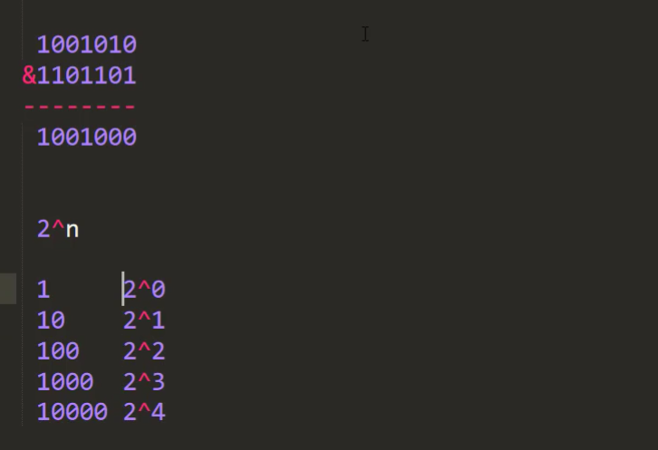
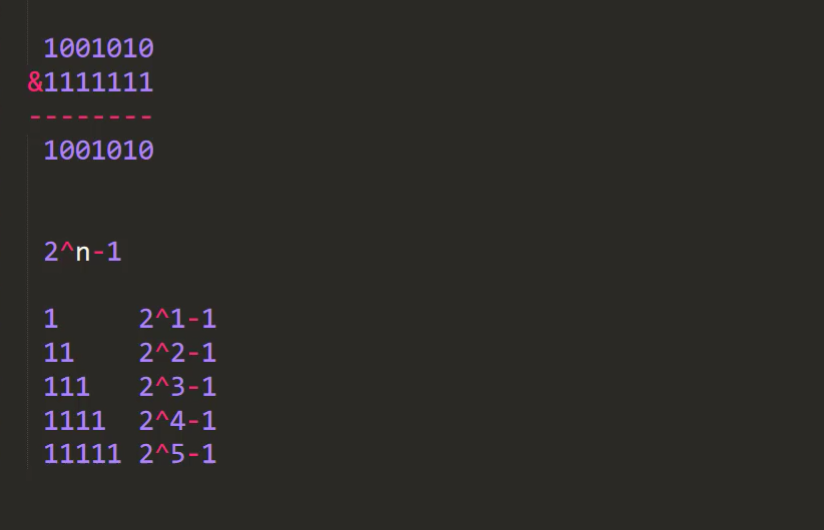
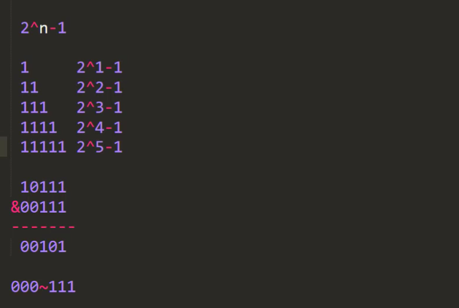

#### &位运算
由0,1组成的二进制数,当相同位置同为1时,经过&位运算结果是1

2^n-1得到的结果一定是由1组成的二进制数

任意数&(2^n-1)得到结果一定在0<=result<=2^n-1

具体示例如下

#### 哈希表的数组长度为什么要设置成2^n

对于计算存放桶数组索引首先&位运算效率高于%(模)运算

桶数组元素个数 table.length 索引范围0~table.length-1

当将table.length设置为2^n时,由hash函数对key进行的hash计算得到的值与table.length-1进行&位运算能够保证
得到的桶索引值在0~table.length-1之间

