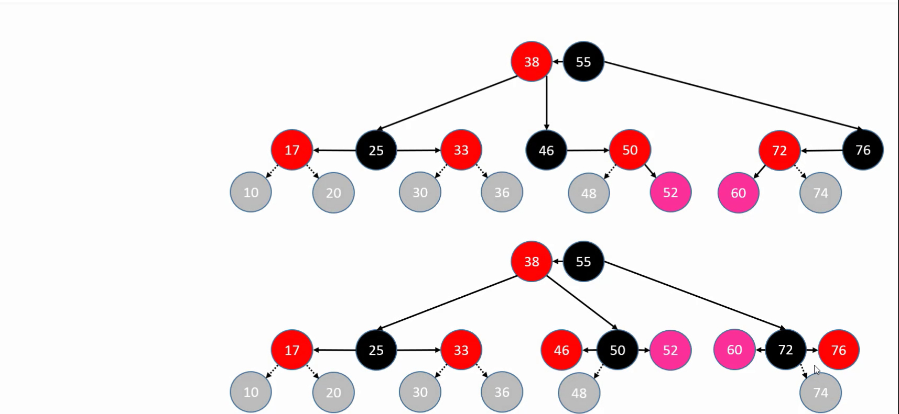
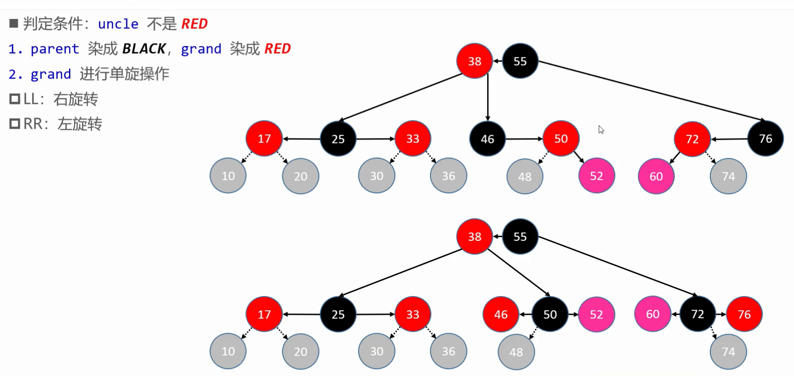
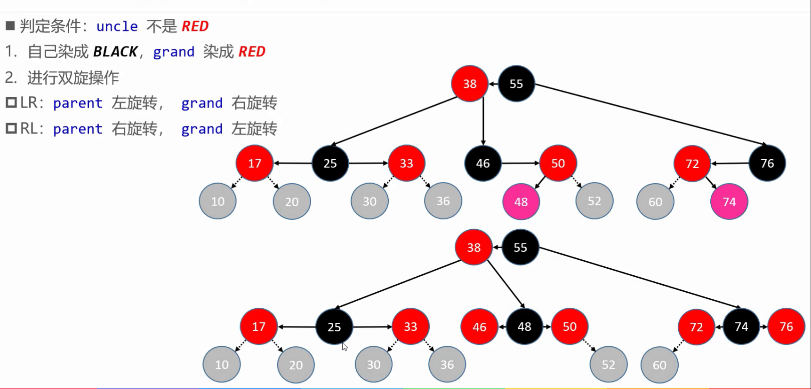
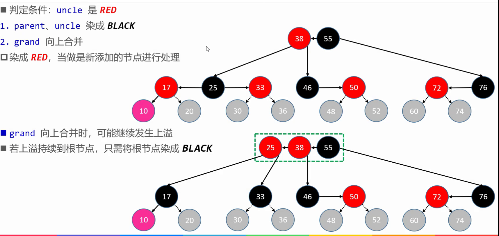
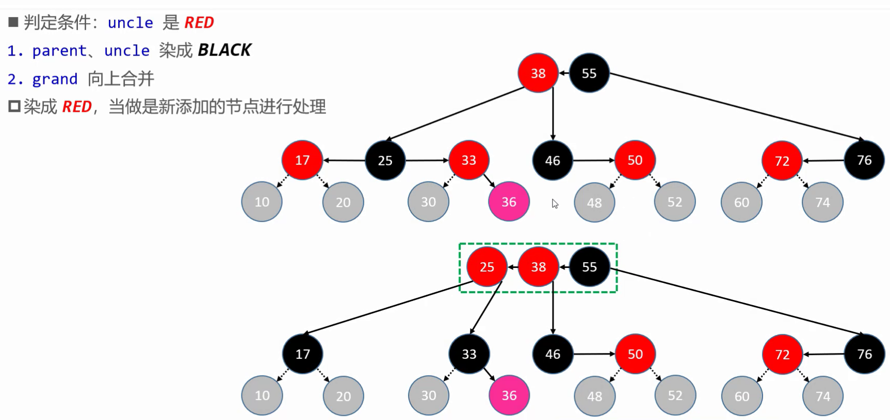
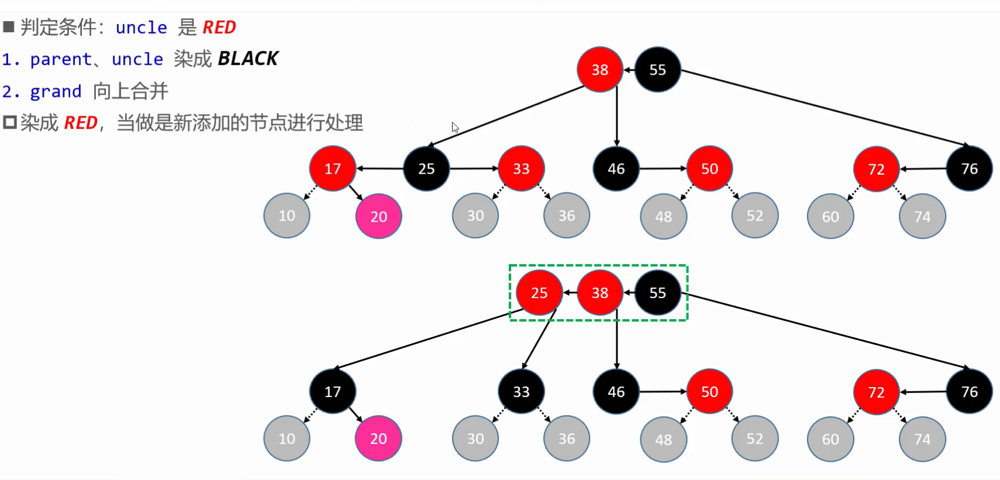
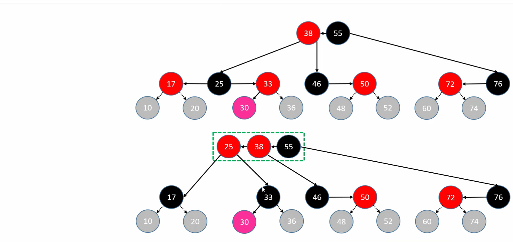

## 红黑树
### 红黑树和2-3-4B-Tree的等价变换
红黑树的黑色节点与其红色子节点合并在一起,从而转换成B-Tree
从而得出红黑树等价转换成2-3-4树后最后一层节点只可能是四种情况:红黑红,红黑,黑红,黑
而根据B-Tree添加节点都是添加到叶子节点,从而得出红黑树添加节点的12中情况
默认添加的节点染为红色,所以根据红黑树的五种性质只有第四种情况,不一定满足,
所以红黑树添加节点的12种情况中,有四种情况满足红黑树的性质4,有8种情况不能满足红黑树第四种性质

#### 黑红 红的右侧添加节点,红黑 红的左侧添加节点情况添加节点 
这种情况,添加节点的叔父节点null即黑色
解决12种添加节点情况中其中8种不满足红黑树第四种性质情况中两种添加节点的情况

具体操作

#### 黑红 红的左侧添加节点,红黑 红的右侧添加节点情况添加节点
这种情况,添加节点的叔父节点null即黑色
解决12种添加节点情况中其中8种不满足红黑树第四种性质情况中两种添加节点的情况

#### 红黑红添加子节点
2-3-4树单个节点最多三个节点,一旦添加一个节点节点个数为4发生上溢,黑色节点grand向上融合,红色节点parent,uncle节点染成黑色而分裂
解决12种添加节点情况中其中8种不满足红黑树第四种性质情况中四种种添加节点的情况

至此红黑树添加节点的12种情况中的8种不满足红黑树性质4的情况全部解决